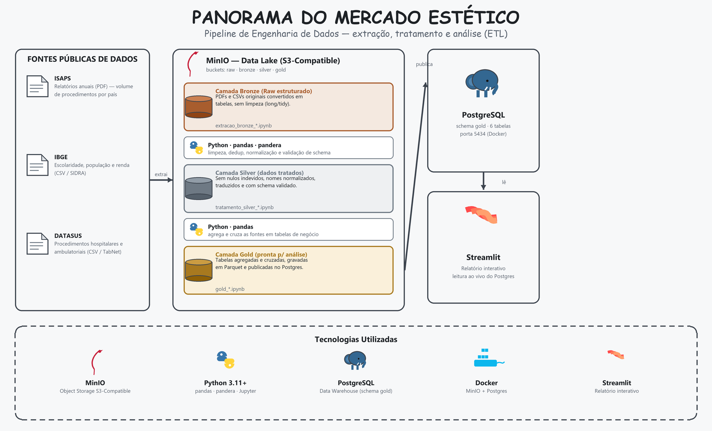

# Panorama do Mercado Estético

Pipeline de engenharia de dados que trata, cruza e analisa dados públicos sobre procedimentos
estéticos — no Brasil e no mundo — para entender o mercado privado (ISAPS), o sistema público de
saúde (DATASUS) e o contexto socioeconômico brasileiro (IBGE) entre 2018 e 2024.

O resultado final é um relatório interativo em Streamlit, lido diretamente do Postgres.

## Arquitetura (medalhão)



O projeto segue a arquitetura em camadas, cada uma num notebook separado por fonte de dado:

```
Raw          →   Bronze              →   Silver                →   Gold
(sem          (extração tabular,       (tratado: dedup,          (agregado, pronto
transformação) ainda sem limpeza)       nulos, normalização,      para análise —
                                        tradução, schema)         Parquet + Postgres)
```

- **Raw** — os arquivos originais (PDF, CSV) são carregados **sem nenhuma transformação** no MinIO
  (bucket `raw`), só para ter uma cópia fiel da fonte, reproduzível a qualquer momento.
- **Bronze** — cada fonte (PDF do ISAPS, CSV do IBGE, CSV do DATASUS) é parseada e estruturada em
  formato tabular (long/tidy), mas ainda sem limpeza — decisões só de estrutura (ex.: separar um
  código de uma descrição, virar colunas largas em linhas).
- **Silver** — dados tratados: deduplicação (proteção contra reprocessamento), remoção de nulos
  (quando o nulo significa "não reportado"), normalização de nomes (país, período), tradução
  PT-BR onde fazia sentido, e validação de schema com `pandera`.
- **Gold** — tabelas de negócio já agregadas e cruzadas entre fontes, gravadas em Parquet e
  publicadas no Postgres (schema `gold`), prontas para consumo por BI ou pelo relatório Streamlit.

Cada camada é lida da anterior via **MinIO** (S3 local) — os notebooks nunca leem o resultado de
outro notebook direto do disco, sempre pelo data lake, para simular um pipeline real.

## Fontes de dados

| Fonte | O que é | Formato original |
|---|---|---|
| **ISAPS** | Relatórios anuais (2018-2024) com volume de procedimentos estéticos por país | PDF |
| **IBGE** (SIDRA) | Escolaridade, população e renda do Brasil | CSV |
| **DATASUS** (TabNet) | Procedimentos hospitalares (SIH/SUS) e ambulatoriais (SIA/SUS) | CSV |

## Estrutura do projeto

```
notebooks/
  extracao_raw.ipynb                       # Local -> MinIO (bucket raw), sem transformação
  extracao_bronze_isaps.ipynb              # Raw -> Bronze (PDFs ISAPS)
  extracao_bronze_ibge.ipynb               # Raw -> Bronze (CSVs IBGE)
  extracao_bronze_datasus.ipynb            # Raw -> Bronze (CSVs DATASUS)
  exploracao_bronze_isaps.ipynb            # EDA da Bronze, mapeando o que a Silver precisa resolver
  exploracao_bronze_ibge.ipynb
  exploracao_bronze_datasus.ipynb
  tratamento_silver_isaps.ipynb            # Bronze -> Silver
  tratamento_silver_ibge.ipynb
  tratamento_silver_datasus.ipynb
  gold_volume_brasil_vs_paises_isaps.ipynb # Silver -> Gold
  gold_procedimentos_reparadores_sus.ipynb
  gold_procedimentos_x_contexto_brasil.ipynb
streamlit_app/
  app.py                                   # Relatório final, lido do Postgres
dados_brutos/                              # Arquivos originais (não versionados no Git)
dados_processados/                         # Parquet gerados localmente (não versionados no Git)
docker-compose.yml                         # MinIO + Postgres
requirements.txt
.env.example                               # Copie para .env e preencha
```

## Como rodar

### 1. Pré-requisitos

- Python 3.11+
- Docker (para MinIO e Postgres)

### 2. Subir a infraestrutura

```bash
docker compose up -d
```

Isso sobe o MinIO (S3 local, console em `http://localhost:9001`) e o Postgres (porta `5434`).

### 3. Configurar o ambiente Python

```bash
python -m venv venv
venv/Scripts/activate          # Windows
pip install -r requirements.txt
```

### 4. Configurar as variáveis de ambiente

```bash
cp .env.example .env
```

Edite o `.env` com as credenciais do MinIO e do Postgres (os valores padrão do
`docker-compose.yml` já funcionam sem alteração, se você não os mudou).

### 5. Rodar os notebooks, na ordem

Os notebooks precisam rodar **nesta ordem**, porque cada camada lê a anterior do MinIO:

1. `extracao_raw.ipynb`
2. `extracao_bronze_isaps.ipynb`, `extracao_bronze_ibge.ipynb`, `extracao_bronze_datasus.ipynb` (qualquer ordem entre si)
3. `tratamento_silver_isaps.ipynb`, `tratamento_silver_ibge.ipynb`, `tratamento_silver_datasus.ipynb`
4. `gold_volume_brasil_vs_paises_isaps.ipynb`, `gold_procedimentos_reparadores_sus.ipynb`, `gold_procedimentos_x_contexto_brasil.ipynb`

Os notebooks `exploracao_bronze_*.ipynb` são opcionais — são a análise exploratória que embasou as
decisões de tratamento da Silver, não fazem parte do fluxo de dados em si.

Abra com Jupyter (`jupyter lab` ou pela extensão do seu editor) e rode célula a célula, ou execute
via linha de comando:

```bash
venv/Scripts/python.exe -m jupyter nbconvert --to notebook --execute --inplace notebooks/<arquivo>.ipynb
```

### 6. Rodar o relatório final

```bash
venv/Scripts/python.exe -m streamlit run streamlit_app/app.py
```

Abre em `http://localhost:8501`, lendo os dados direto das tabelas Gold no Postgres.

## Limitações conhecidas

Documentadas com mais detalhe no próprio relatório Streamlit (seção "Sobre este relatório"):
PDFs de 2016/2017 do ISAPS incompatíveis com o parser, encoding divergente entre fontes, nomes de
país/procedimento inconsistentes entre edições do relatório, ausência de dado per capita para
países além do Brasil, escopo do SUS restrito a procedimentos reparadores (não comparável 1:1 ao
ISAPS), e lacunas temporais reais (ex.: pandemia) preservadas como ausência de dado, não estimadas.
